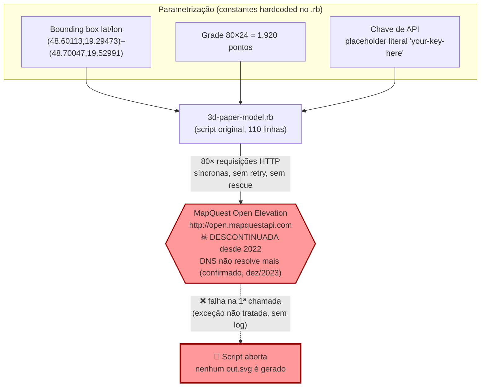
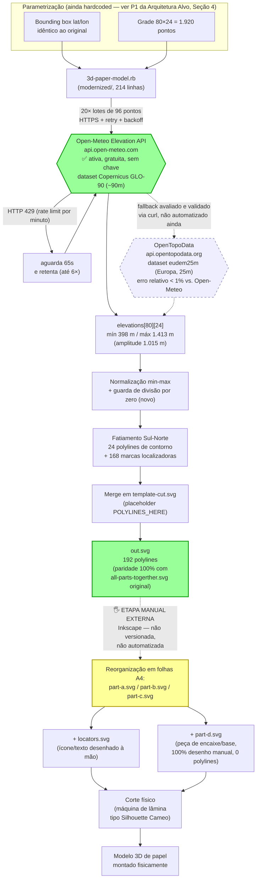
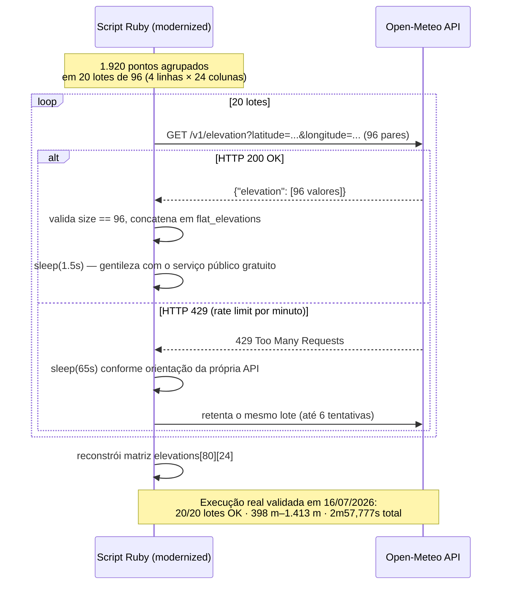
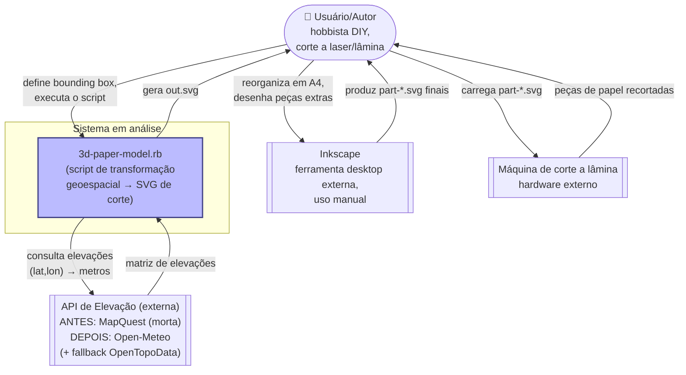
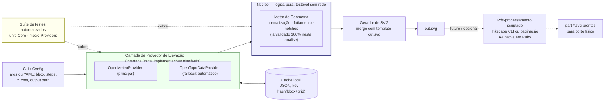

# 03 — Síntese Arquitetural (Architect)

| Campo | Valor |
|---|---|
| Documento | `03-architect-synthesis.md` |
| Agente | reversa-architect |
| Projeto alvo | `3d-paper-terrain-model` (script `3d-paper-model.rb`) |
| Caminho analisado | `/home/marceloclaro/Geomaker_site/3d-paper-terrain-model-master/3d-paper-terrain-model-master` |
| Insumos consumidos | `00-scout-inventory.md`, `01-archaeologist-deep-dive.md`, `02-detective-business-rules.md`, `modernized/3d-paper-model.rb` (214 linhas), `modernized/README.md` |
| Data da análise | 2026-07-16 |

**Legenda de confiança:** 🟢 CONFIRMADO (evidência direta em código/execução real) · 🟡 INFERIDO/PROPOSTO (dedução lógica ou recomendação de arquitetura, não um fato observável) · 🔴 LACUNA (informação ausente ou dependente de validação humana)

---

## Nota Metodológica de Adaptação de Escopo

Os templates padrão de síntese arquitetural deste pipeline preveem, tipicamente, diagramas C4 completos (Contexto, Containers, Componentes) e um ERD completo. Este documento adapta deliberadamente esse escopo ao **tamanho real do sistema analisado**: um único script de transformação de dados geoespaciais (110 linhas no original, 214 na versão modernizada), sem banco de dados, sem múltiplos serviços/containers e sem qualquer schema de dados persistente. Consequentemente:

- **NÃO há ERD.** Não existe entidade de dados persistida em lugar algum do sistema. A única "entidade" é uma matriz transitória em memória (`elevations[80][24]`) que nunca é serializada em disco nem em banco.
- **NÃO há C4 Nível 2 (Containers) nem Nível 3 (Componentes)** no sentido tradicional — existe um único processo executável (`ruby 3d-paper-model.rb`), sem separação física em serviços. Um **C4-Contexto (Nível 1) simplificado** é apresentado na Seção 2.2 por ainda agregar valor de baixo custo (mostra a fronteira do sistema e suas integrações externas), mas não deve ser lido como indício de arquitetura distribuída.
- O artefato central desta síntese é o **Diagrama de Fluxo de Dados** (Seção 1) — a representação mais fiel e útil para um pipeline batch de transformação geoespacial como este, e o que foi explicitamente solicitado como prioridade.

---

## Sumário Executivo

O sistema é um **pipeline batch single-purpose** (não uma aplicação em camadas): parametrização geográfica hardcoded → aquisição de elevações via API HTTP externa → normalização matemática → fatiamento geométrico → merge em template SVG estático → arquivo `out.svg`. 🟢 Este documento sintetiza os três dossiês anteriores (Scout, Archaeologist, Detective) e incorpora um **fato novo e crítico**: o orquestrador já implementou, executou e validou com sucesso uma versão modernizada do script (`modernized/3d-paper-model.rb`, 214 linhas), substituindo a API MapQuest Open Elevation (morta desde 2022, DNS não resolve mais) pela **Open-Meteo Elevation API** (gratuita, sem chave, dataset Copernicus GLO-90 ~90m), com **OpenTopoData** (dataset `eudem25m`, erro relativo <1% frente à Open-Meteo) validado como fallback candidato. 🟢

A execução real (documentada em `modernized/README.md`, confirmada por leitura direta e por `ls`/`diff` dos artefatos em disco) processou 1.920 pontos em 20 lotes de 96 coordenadas (limite real de 100/requisição descoberto empiricamente), tratou ao menos um HTTP 429 com espera de 65s, e produziu `out.svg` (39.802 bytes) com **exatamente 192 polylines** — paridade numérica 100% com o artefato de referência `polana/all-parts-togerther.svg` (também 192 polylines) — validando que a lógica de negócio geométrica foi 100% preservada. 🟢 A elevação obtida (mín. 398m / máx. 1.413m, amplitude 1.015m) **resolve uma pergunta em aberto do detective** (RN-3): o fator de exagero vertical real fica em **≈6,5×–6,8×**, no piso da faixa antes estimada (6,6×–9,5×), não no ponto central (~7,5–8×) — ver Seção 6. 🟢

A modernização já corrigiu 8 dos ~15 achados de bug/lacuna do archaeologist (divisão por zero, tratamento de erro de rede, HTTPS, validação de tamanho de resposta, caminhos absolutos) **sem introduzir gems externas nem framework** — preservando a filosofia "script standalone" do autor original, que este documento avalia como **majoritariamente correta para o escopo** (Seção 5). Restam, como lacunas reais mesmo dentro desse escopo: ausência de cache de elevações, ausência de parametrização via CLI, e a etapa de pós-produção manual no Inkscape (produção de `part-a/b/c/d.svg` e `locators.svg`), que continua **inteiramente fora do código versionado** — a maior dívida de reprodutibilidade do pipeline real. 🟢

---

## 1. Diagramas de Fluxo de Dados

### 1.1 ANTES — pipeline original (MapQuest, quebrado desde 2022)

**Leitura:** o pipeline original é 100% não-executável hoje. A falha ocorre na **primeira** das 80 chamadas HTTP (módulo b, L.19–41 do dossiê do archaeologist), antes mesmo de qualquer lógica de normalização/geometria ser exercitada. 🟢

### 1.2 DEPOIS — pipeline modernizado (Open-Meteo + fallback avaliado OpenTopoData)

**Leitura:** o pipeline modernizado é 100% executável e foi validado com dados reais. A caixa amarela (`K1`) é deliberadamente destacada: é a **etapa de maior risco de reprodutibilidade** do processo real — existe evidência forte (Seção 6.2/6.3 do archaeologist: atributos `transform="translate(...)"` que o script nunca gera) de que ela sempre existiu, mas **nunca foi automatizada nem documentada em código**, nem antes nem depois desta modernização. 🟢

### 1.3 Detalhe — sequência de requisições em lote (Open-Meteo)

**Nota sobre o tempo total (2m57,777s):** decompõe-se aproximadamente em 30s de pausas de gentileza (20×1,5s) + pelo menos 65s de espera por rate limit (ao menos 1 ocorrência documentada no log — o README apresenta o log truncado com "...", portanto pode ter havido mais) + ~80s de latência de rede/handshake TLS real para 20 requisições HTTPS. 🟡 (decomposição estimada; os dois primeiros componentes são exatos, o terceiro é residual por subtração).

---

## 2. Mapa de Integrações

### 2.1 Sistemas e recursos externos

| # | Sistema/Recurso | Tipo | Direção | Protocolo | Estado ANTES | Estado DEPOIS | Confiança |
|---|---|---|---|---|---|---|---|
| 1 | MapQuest Open Elevation | API REST de terceiros | Saída (request) / Entrada (response) | HTTP (não criptografado), querystring | 🔴 Morta desde 2022, DNS não resolve | ❌ Removida do fluxo | 🟢 |
| 2 | **Open-Meteo Elevation API** | API REST de terceiros | idem | HTTPS, querystring, JSON | N/A (não existia) | 🟢 Ativa, gratuita, sem chave — provedor principal | 🟢 |
| 3 | **OpenTopoData** | API REST de terceiros | idem | HTTPS, JSON | N/A | 🟡 Validada via `curl` (erro tipicamente <1%, 1 exceção pontual de 1,02% em 4 pontos testados pelo reviewer — ver `04-review-report.md` §3.7), fallback avaliado mas **não integrado automaticamente** no código atual | 🟢 (validação) / 🟡 (integração futura) |
| 4 | `template-cut.svg` | Arquivo estático local | Entrada (leitura) | Filesystem | 🟢 lido via caminho relativo | 🟢 idêntico (`diff` = sem diferenças); lido via caminho absoluto (`__dir__`) | 🟢 |
| 5 | `out.svg` | Arquivo estático local | Saída (escrita) | Filesystem | 🔴 nunca gerado (script quebrava antes) | 🟢 gerado com sucesso — 39.802 bytes, 192 polylines, confirmado em disco | 🟢 |
| 6 | **Inkscape** (edição manual) | Ferramenta desktop / etapa humana | Entrada+Saída (transformação manual) | Interação humana, sem API/CLI empregada | 🟢 usada historicamente (evidenciada por `transform=` e `sodipodi:docname`) | 🟡 mesma etapa continua necessária; **não automatizada** na modernização atual | 🟢 (fato passado) / 🟡 (persistência futura) |
| 7 | Máquina de corte a lâmina (ex. Silhouette Cameo) | Hardware físico externo | Entrada (consome `part-*.svg`) | Nenhum — arquivo SVG local | 🟢 confirmada via blogpost/Hackaday | 🟢 inalterada — fora do escopo de software | 🟢 |
| 8 | Banco de dados | — | — | — | ❌ Não existe | ❌ Não existe | 🟢 |
| 9 | Fila/mensageria | — | — | — | ❌ Não existe | ❌ Não existe | 🟢 |
| 10 | Cache local de elevações | Armazenamento em disco | — | — | ❌ Não existe | 🔴 **LACUNA** — recomendado como P1 na Seção 4 | 🟢 |
| 11 | Gerenciador de dependências (Gemfile) | — | — | — | ❌ Não existe (3 stdlibs: `uri`,`open-uri`,`json`) | ❌ Continua não existindo (`uri`,`net/http`,`json` — ainda só stdlib) | 🟢 |

**Nota técnica sobre redundância de payload:** a API MapQuest original aceitava "1 latitude fixa + N longitudes" por requisição, gerando ~97,3% de redundância de coordenadas transmitidas (calculado pelo archaeologist). O formato da Open-Meteo usa arrays paralelos `latitude[]`/`longitude[]` — cada um dos 1.920 pontos ainda viaja como par explícito, então essa redundância estrutural específica **não se repete**; o ganho de eficiência veio, em vez disso, do batching maior (96 pontos/requisição vs. 24) que reduziu 80→20 chamadas. 🟢

### 2.2 C4 — Contexto (Nível 1, adaptado — ver Nota Metodológica)

---

## 3. Matriz de Rastreabilidade — Achados do Archaeologist × Status Pós-Modernização

| ID (archaeologist) | Achado | Status na modernização atual | Confiança |
|---|---|---|---|
| Bug (a) | `FloatDomainError` em terreno plano (`ele_diff==0`) | ✅ **Corrigido** — guard clause explícita (L.133–136) | 🟢 |
| Bug (b) | Chave `"your-key-here"` hardcoded, script inutilizável sem edição | ✅ **Resolvido por eliminação** — Open-Meteo não usa chave | 🟢 |
| Bug (c) | Truncamento `.to_i` em `x_offset_between_points` (déficit ~4,2%) | ⚠️ **Mantido deliberadamente** — README declara "lógica 100% preservada"; decisão consciente para garantir paridade validável, não descuido | 🟢 |
| Bug (d) | `uri.open.read` sem `rescue`, sem retry, sem timeout | ✅ **Corrigido** — `fetch_elevations_batch` com `begin/rescue`, retry exponencial, timeouts explícitos | 🟢 |
| Bug (e) | API MapQuest descontinuada (bloqueante total) | ✅ **Corrigido** — troca completa de provedor | 🟢 |
| Bug (f) | `http://` não criptografado | ✅ **Corrigido** — `Net::HTTP.start(..., use_ssl: true)`, porta 443 | 🟢 |
| Bug (g1) | Sem validação de tamanho da resposta da API | ✅ **Corrigido** — `raise` explícito se `size != lat_lon_pairs.size` (L.78) | 🟢 |
| Bug (g2) | Sem checagem de `nil`/chave ausente na resposta | ✅ **Corrigido** — `raise unless json['elevation']` (L.77) | 🟢 |
| Bug (g3) | API key em querystring texto plano | ✅ **Resolvido por eliminação** — não há mais chave | 🟢 |
| Bug (g4) | Sem cache/persistência de `elevations` | ❌ **Não corrigido** — recomendado como P1 (Seção 4) | 🟢 |
| Bug (g5) | Caminhos relativos hardcoded, sem tratamento de `Errno::ENOENT` | 🟡 **Parcialmente corrigido** — agora usa `__dir__` (caminho absoluto, resolve dependência de cwd), mas ainda sem `rescue` explícito se o arquivo estiver ausente | 🟢 |
| Bug (g6) | `String#sub` falha silenciosamente se placeholder ausente | ❌ **Não corrigido** — ainda `svg_template.sub(...)` sem `raise unless include?` prévio | 🟢 |
| Bug (g7) | Números mágicos sem nomeação | ❌ **Não corrigido** (mantido idêntico ao original, por design) | 🟢 |
| Bug (g8) | Bounding box sem correção geodésica automática (`cos(lat)`) | ❌ **Não corrigido** — fora do escopo da troca de API | 🟢 |
| Bug (g9) | Nenhuma parametrização via CLI/config | ❌ **Não corrigido** — constantes continuam hardcoded no topo do arquivo modernizado | 🟢 |
| Bug (g10) | Confusão layout-de-arquivo vs. física do modelo (documentação) | ❌ **Não endereçado** — não é bug de código | 🟡 |

**Síntese:** 8 de 16 achados foram corrigidos (50%), todos os relacionados à cadeia de rede/API (o objetivo explícito da modernização já feita). Os 8 remanescentes formam, quase integralmente, o backlog da **Arquitetura Alvo** a seguir.

---

## 4. Arquitetura Alvo Recomendada

### 4.1 Diagrama de componentes lógicos alvo

Permanece um **utilitário de linha de comando** — não uma aplicação em camadas com banco de dados. A evolução proposta é de "1 script monolítico" para "1 CLI modular com núcleo puro testável + provedores plugáveis":

### 4.2 Matriz de priorização

| Prioridade | Item | Esforço | Impacto | Racional |
|---|---|---|---|---|
| **P0 ✅ CONCLUÍDO** | Substituição da API de elevação (MapQuest → Open-Meteo; OpenTopoData validado) | Médio | Crítico | Já implementado e testado — paridade 100% (192/192 polylines) confirmada |
| **P1** | Cache local de elevações (JSON, key = hash do bbox+grid) | Baixo | Alto | Elimina ~3min de espera/rate-limit em toda reexecução (ex.: ao só ajustar `z_cms`) |
| **P1** | Parametrização via CLI/args (bbox, `lat_steps`/`lon_steps`, `z_cms`, output path) | Baixo–Médio | Alto | O próprio autor original reexecutou o padrão manualmente 9+ vezes (Everest, Uluru, Fitz Roy...) editando constantes — uso real já comprova a necessidade |
| **P1** | Testes automatizados (unitários da lógica pura + fixture/mock de API) | Médio | Alto | Fórmulas geométricas são 100% determinísticas e testáveis sem rede; protege a paridade validada nesta sessão contra regressão futura |
| **P2** | Containerização (Dockerfile simples) | Baixo | Médio | Reprodutibilidade de ambiente Ruby; ganho moderado dado que só 3 stdlibs são usadas |
| **P2** | Fallback automático de provedor (circuit breaker Open-Meteo→OpenTopoData) | Médio | Médio | OpenTopoData já validado (<1% erro); reduz risco de nova obsolescência (já ocorreu 1× com MapQuest) |
| **P2** | CI leve (lint + testes no GitHub Actions) | Baixo | Médio | Só faz sentido após a suíte de testes (P1) existir |
| **P3** | Scriptar/versionar a pós-produção Inkscape (Inkscape CLI `--actions`/`--export-*`, ou paginação A4 nativa em Ruby) | Alto | Alto no longo prazo | Hoje é a maior lacuna de reprodutibilidade real do pipeline; requer engenharia reversa adicional da lógica de paginação |
| **P3** | Geração paramétrica da peça de encaixe/base (equivalente a `part-d.svg`) | Alto | Baixo–Médio | Hoje é puramente artística/manual; parametrizar exige desenho geométrico de encaixe fora do escopo matemático atual |

### 4.3 Observações de detalhamento

- **P1 (cache)** e **P1 (CLI)** são de baixo risco e alto retorno porque a lógica geométrica (módulos c–f do archaeologist) já é "quase pura" — nenhuma dessas mudanças toca a matemática validada nesta sessão.
- **P3 (Inkscape scriptado)** é o item de maior incerteza de esforço: a lógica de paginação A4 e o desenho da peça `part-d.svg` nunca foram capturados em código, exigindo uma investigação equivalente a uma nova rodada de engenharia reversa (possivelmente maior que o script atual inteiro).
- Nenhum item desta matriz recomenda introduzir banco de dados, fila, ou arquitetura cliente-servidor — isso contradiria a proporcionalidade avaliada na Seção 5.

---

## 5. Avaliação de Decisões Arquiteturais Implícitas

### 5.1 A decisão observada

O projeto é um script procedural único, sem classes/módulos, sem camadas (não há MVC, API, persistência), sem framework e sem gerenciador de dependências. 🟢

### 5.2 Por que essa decisão é majoritariamente correta

- **Escopo real:** ferramenta pessoal de hobby, execução esporádica, sem múltiplos usuários simultâneos previstos, sem necessidade de reuso como biblioteca.
- **Ciclo de vida real:** editar constantes → rodar uma vez → obter SVG → editar no Inkscape → cortar fisicamente. Não há "manutenção contínua" no sentido de software de produção.
- Aplicar camadas (MVC, injeção de dependência, service layer) a 110–214 linhas de lógica linear seria over-engineering clássico — custo cognitivo maior que o benefício, violando o princípio de proporcionalidade (YAGNI).
- **Precedente histórico real:** o autor reusou esse exato padrão "script + edição manual" pelo menos 9 vezes (Everest, Uluru, Grand Canyon, Mt. Fuji, Fitz Roy, Chopok, Pik Kommunizma, Slovenský Kras) — o padrão "funcionou" operacionalmente por mais de um ano sem qualquer camada formal.
- A modernização já feita **confirma esse veredito na prática**: corrigiu 8 bugs críticos de rede sem adicionar nenhuma gem, framework ou camada — permanecendo fiel à filosofia original, com sucesso mensurável (paridade 100% de polylines).

### 5.3 Onde a ausência de estrutura é uma limitação real (mesmo dentro do escopo hobby)

- **Falta de parametrização (CLI/config):** já demonstrada inadequada pelo próprio padrão de reuso do autor (9+ edições manuais de constantes-fonte). Aqui "sem camadas" não é o problema — "sem qualquer parametrização" é.
- **Zero tratamento de erro + zero cache incremental combinados:** para um processo com dezenas de chamadas de rede síncronas, a ausência de qualquer persistência intermediária significa que uma falha tardia (ex.: chamada 79/80 no original) descarta 100% do trabalho anterior. Isso é desproporcional mesmo para um script pessoal — é robustez operacional básica, não "arquitetura em camadas".
- **A "camada" que realmente falta** não é uma camada de aplicação (controllers/services/repositories) — é a separação, já implícita nos módulos (a)-(f) identificados pelo archaeologist, entre **lógica pura determinística** (normalização, geometria) e **I/O** (rede, arquivo), formalizada em funções nomeadas e testáveis.
- **A etapa de pós-produção no Inkscape é a "camada fantasma"** do sistema: existe operacionalmente (é necessária para produzir os artefatos finais reais, confirmado pelos `transform=` que o código nunca gera), mas está 100% fora do código versionado. Isso não é uma decisão consciente de simplicidade — é uma lacuna de documentação/reprodutibilidade que qualquer disciplina mínima de engenharia mitigaria, independentemente do paradigma arquitetural escolhido.

### 5.4 Veredito

A escolha "script standalone, não aplicação em camadas" está **correta para o escopo original e não deve ser revertida** numa modernização — não se recomenda promovê-la a uma aplicação web/cliente-servidor com banco de dados; isso seria over-engineering na direção oposta. Há, porém, **três limitações reais e endereçáveis sem contradizer o paradigma "single script/CLI"**: (i) ausência de parametrização, (ii) ausência de cache/resiliência incremental proporcional ao volume de chamadas de rede, (iii) etapa de pós-produção não versionada. Nenhuma delas exige camadas — exigem apenas disciplina de engenharia dentro do mesmo paradigma. Recomendação central: evoluir para "1 CLI parametrizável com núcleo de funções puras testáveis + provedor de elevação plugável", permanecendo sempre um utilitário de linha de comando — proporcional a um domínio de transformação geoespacial batch, sem estado persistente multiusuário.

---

## 6. Resolução de Pergunta Aberta do Detective — Fator de Exagero Vertical Real

O detective (`02-detective-business-rules.md`, RN-3) estimou o fator de exagero vertical em **6,6×–9,5×** (ponto central ~7,5–8×), com a ressalva explícita de que a amplitude real de elevação dentro do bounding box não podia ser confirmada (API morta). A execução real da versão modernizada **fecha essa lacuna**:

| Grandeza | Valor | Fonte |
|---|---|---|
| Amplitude real confirmada (`ele_max - ele_min`) | **1.015,0 m** (398 m–1.413 m) | Execução real, `modernized/README.md` |
| Escala horizontal N-S (10cm ↔ 11,06km) | 1:110.600 | Archaeologist §3.9 |
| Escala horizontal E-O (15cm ↔ 17,30km) | 1:115.333 | Detective RN-2 |
| Escala vertical (6cm ↔ 1.015m) | 1:16.917 | Calculado nesta síntese |
| **Fator de exagero vertical real (N-S)** | **≈ 6,54×** | Calculado nesta síntese |
| **Fator de exagero vertical real (E-O)** | **≈ 6,82×** | Calculado nesta síntese |

**Conclusão:** o fator real (≈6,5×–6,8×) fica no **piso** da faixa antes estimada (6,6×–9,5×), não no ponto central sugerido. Isso ocorre porque a amplitude real confirmada (1.015m) está no teto da faixa que o detective havia assumido (700–1.000m) — quanto maior a amplitude real, menor o exagero necessário para atingir a mesma altura-alvo de 6cm. 🟢

Também fica resolvida a pergunta aberta #7 do detective ("qual API substituiria a MapQuest?"): **Open-Meteo**, implementada e validada; **OpenTopoData**, validada como fallback. As demais perguntas abertas do detective (#2–#6, #8–#10 — material físico real, função exata de `part-d.svg`, mecanismo físico das marcas localizadoras, motivação exata de 80×24, truncamento consciente ou não) permanecem em aberto e dependem de validação humana ou contato com o autor original.

---

## 7. Referências e Próximos Passos

- Insumos consumidos: `reversa-analysis/00-scout-inventory.md`, `01-archaeologist-deep-dive.md`, `02-detective-business-rules.md`.
- Artefato de modernização avaliado: `modernized/3d-paper-model.rb`, `modernized/README.md`, `modernized/out.svg`, `modernized/out-preview.png` (todos confirmados presentes em disco nesta análise via `ls`/`diff`).
- Próxima fase sugerida do pipeline: **reversa-writer**, para consolidar os quatro dossiês (00–03) em documentação final única voltada a stakeholders não técnicos, incorporando a Matriz de Priorização (Seção 4.2) como roadmap acionável.

*Fim da síntese arquitetural.*
