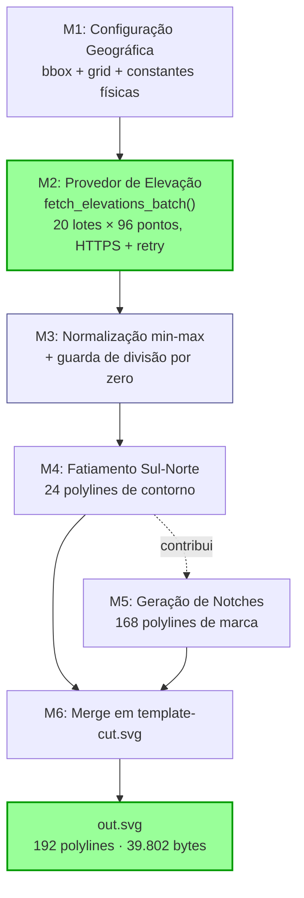
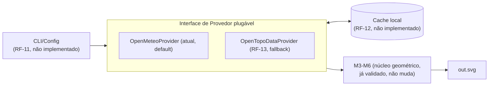

# Design — 3D Paper Terrain Model (pós-modernização)

| Campo | Valor |
|---|---|
| Documento | `reversa-analysis/specs/design.md` |
| Agente | reversa-writer |
| Projeto alvo | `3d-paper-terrain-model` (script `3d-paper-model.rb` + versão `modernized/`) |
| Insumos consumidos | `01-archaeologist-deep-dive.md` (decomposição descritiva original), `03-architect-synthesis.md` (diagramas, matriz de priorização, avaliação arquitetural), `modernized/3d-paper-model.rb` |
| Data | 2026-07-16 |

**Legenda de confiança:** 🟢 CONFIRMADO (evidência direta em código/execução real) · 🟡 PROPOSTO/NORMATIVO (formalização prescritiva de um comportamento já observado, ou recomendação de design ainda não implementada) · 🔴 LACUNA

**Convenção deste documento:** ao contrário dos dossiês de análise (que descrevem "o que o código faz"), este documento é **normativo** — descreve "o que o sistema DEVE fazer" como contrato, mesmo quando o código atual já satisfaz esse contrato de forma inline/não-nomeada. Onde o código-fonte real usa lógica inline em vez de uma função nomeada, isso é sinalizado explicitamente.

---

## 0. Nota de Proporcionalidade Arquitetural (herdada do Architect)

Conforme `03-architect-synthesis.md` (Nota Metodológica), este sistema é um **pipeline batch single-purpose** de ~214 linhas, sem banco de dados, sem múltiplos serviços e sem estado persistente entre execuções. Este design **não** introduz C4 Nível 2/3 completo nem ERD — não há entidades persistidas (a única "entidade" é a matriz transitória `elevations[80][24]`, que existe apenas em memória durante a execução). O nível de formalismo aplicado abaixo (contratos de função, dicionário de dados tipado) é deliberadamente proporcional a um utilitário de linha de comando, não a uma aplicação em camadas — decisão validada e endossada pelo `reversa-architect` (Seção 5.4: "não se recomenda promovê-la a uma aplicação web/cliente-servidor... isso seria over-engineering na direção oposta").

---

## 1. Decomposição Modular Normativa

A tabela abaixo formaliza, como contrato, os 6 módulos originalmente identificados de forma descritiva pelo `reversa-archaeologist` (`01-archaeologist-deep-dive.md`, Seção 2). Cada módulo é redefinido aqui em termos de **responsabilidade única, entrada, saída e invariante obrigatório** — não apenas "o que o código faz hoje", mas "o que qualquer reimplementação futura DEVE preservar".

| # | Módulo | Localização no código modernizado | Responsabilidade normativa | Invariante obrigatório |
|---|---|---|---|---|
| M1 | **Configuração Geográfica** | L.30-37 | Definir bounding box (`lat0,lon0,lat1,lon1`), resolução de grade (`lat_steps,lon_steps`) e constantes físicas (`one_cm_in_pts, z_cms`) | `lat1 > lat0 ∧ lon1 > lon0 ∧ lat_steps > 0 ∧ lon_steps > 0` (🟡 NÃO validado hoje — ver Seção 5, Risco R1) |
| M2 | **Provedor de Elevação** (`fetch_elevations_batch`) | L.59-100 | Dado um lote de pares `(lat,lon)`, retornar um array de elevações em metros na mesma ordem e cardinalidade, com retry/backoff e tratamento de rate limit | `resultado.size == lat_lon_pairs.size` (🟢 validado por `raise` explícito, L.78) |
| M3 | **Normalização/Conversão métrica→SVG** | L.130-148 | Converter a matriz de elevações (metros) em uma matriz de inteiros no intervalo `[0, cm_to_svg_point_ratio]` (pontos SVG), via normalização min-max | `∀ e ∈ elevations: 0 ≤ pixel_height(e) ≤ cm_to_svg_point_ratio` — **quebra se `ele_diff == 0`**, mitigado por guarda explícita (L.133-136) |
| M4 | **Motor de Geometria — Fatiamento Sul-Norte** | L.154-178 | Para cada uma das `lon_steps` fatias, gerar 1 polyline de contorno fechada com `lat_steps + 4` vértices (2 de canto superior-esquerdo + `lat_steps` pontos de perfil + 2 de fechamento superior-direito) | `polylines_contorno.size == lon_steps` (🟢 validado: 24 no run real) |
| M5 | **Motor de Geometria — Notches (marcas localizadoras)** | L.181-201 | Para cada fatia e cada múltiplo de 10 em `(1...lat_steps)`, gerar 1 polyline de 6 vértices em forma de seta | `polylines_notch.size == lon_steps × ⌊(lat_steps-1)/10⌋ = 24 × 7 = 168` (🟢 validado no run real) |
| M6 | **Montagem/Merge de Template** | L.207-212 | Ler `template-cut.svg`, substituir a primeira ocorrência de `POLYLINES_HERE` pela concatenação de M4+M5, gravar `out.svg` | `total_polylines_out.svg == lon_steps × 8` (🟢 validado: 192 = 192, confirmado por este agente via `grep`) |

**Nota de design (M1):** o `reversa-architect` propõe, na arquitetura-alvo (Seção 4.1 de `03-architect-synthesis.md`), que M1 evolua para uma camada `CLI/Config` desacoplada dos módulos M2-M6, e que M2 evolua para uma interface `Providers` plugável (`OpenMeteoProvider` / `OpenTopoDataProvider`) com uma camada de `Cache` intermediária. Este design formaliza essa proposta na Seção 4 abaixo.

---

## 2. Diagrama de Fluxo (adaptado de `03-architect-synthesis.md`, Seções 1.2 e 1.3)

### 2.1 Fluxo de dados ponta a ponta (estado atual — implementado)



### 2.2 Sequência de requisições em lote — contrato de M2 (adaptado de `03-architect-synthesis.md`, Seção 1.3)

```mermaid
sequenceDiagram
    participant M1 as M1 (Configuração)
    participant M2 as M2 (fetch_elevations_batch)
    participant OM as Open-Meteo API

    M1->>M2: all_points (1920 pares lat/lon, fatiados em lotes de 96)
    loop 20 lotes
        M2->>OM: GET /v1/elevation?latitude=...&longitude=... (96 pares)
        alt HTTP 200
            OM-->>M2: {"elevation": [96 floats]}
            M2->>M2: valida size == 96 (RF-07)
            M2->>M2: sleep(1.5s) — gentileza
        else HTTP 429
            OM-->>M2: 429 Too Many Requests
            M2->>M2: raise RateLimitError; sleep(65s); retry (até 6×)
        else erro de rede/timeout/5xx
            M2->>M2: sleep([tentativa,6].min); retry (até 6×)
        end
    end
    M2-->>M1: elevations[80][24] completo
```

### 2.3 Arquitetura-alvo recomendada (não implementada — referência normativa para RF-11/12/13)



*Diagramas completos (incluindo estado ANTES com MapQuest) disponíveis na íntegra em `03-architect-synthesis.md`, Seções 1.1-1.3 e 4.1 — reproduzidos aqui em forma reduzida/anotada para autocontenção deste documento de design.*

---

## 3. Contratos de Função

Esta seção formaliza assinaturas, pré-condições, pós-condições e exceções. Onde o código-fonte real implementa o contrato via lógica inline (não uma função Ruby nomeada separadamente), isso é sinalizado com **[INLINE]**.

### 3.1 `fetch_elevations_batch` — 🟢 implementado como função nomeada real

```ruby
def fetch_elevations_batch(lat_lon_pairs, max_retries: 6) -> Array<Float>
```

| Aspecto | Contrato |
|---|---|
| **Entrada** | `lat_lon_pairs: Array<[Float, Float]>` — lista de pares `[latitude, longitude]`, tamanho ≤ `BATCH_SIZE` (96, ver Seção 5.2) |
| **Entrada opcional** | `max_retries: Integer` (padrão 6) — número máximo de tentativas antes de propagar falha definitiva |
| **Saída (sucesso)** | `Array<Float>` — elevações em metros, **mesma ordem e cardinalidade** de `lat_lon_pairs` |
| **Pré-condição** | `lat_lon_pairs.size > 0`; nenhuma validação explícita de latitude/longitude fisicamente válida (-90..90 / -180..180) — 🟡 lacuna de design não coberta nesta versão |
| **Pós-condição (garantida por `raise`)** | `resultado.size == lat_lon_pairs.size` (L.78); campo `elevation` presente na resposta JSON (L.77) |
| **Exceções levantadas** | `RateLimitError` (interna, tratada com `sleep(65)` + retry, L.71-72); `RuntimeError` genérico após esgotar `max_retries` para qualquer outra falha (rede, HTTP não-2xx, JSON malformado, tamanho divergente) |
| **Efeitos colaterais** | `sleep()` (bloqueante); `warn` (stderr) a cada tentativa falha ou lote concluído |
| **Idempotência** | Sim, do ponto de vista do provedor externo (consulta somente-leitura); **não** memoizada internamente (cada chamada é uma nova requisição de rede — ver RF-12/cache como lacuna) |

### 3.2 `normalize_and_scale` — 🟡 **[INLINE]**, contrato formalizado aqui pela primeira vez

O código atual (L.140-148) não possui esta função como unidade nomeada — a lógica está inline no corpo principal do script. Este design formaliza o contrato que ela DEVE satisfazer, como base para a futura extração em função pura testável (pré-requisito de RNF-06).

```ruby
def normalize_and_scale(elevations, cm_to_svg_point_ratio) -> Array<Array<Integer>>
```

| Aspecto | Contrato |
|---|---|
| **Entrada** | `elevations: Array<Array<Float>>` (forma `lat_steps × lon_steps`, metros); `cm_to_svg_point_ratio: Integer` (= `one_cm_in_pts × z_cms`) |
| **Saída** | `Array<Array<Integer>>`, mesma forma, valores em `[0, cm_to_svg_point_ratio]`, truncados (`.to_i`, não arredondados — ver decisão de design 5.4) |
| **Pré-condição obrigatória** | `elevations.flatten.max != elevations.flatten.min` — **se violada, DEVE levantar exceção explícita** (não propagar `NaN`) |
| **Fórmula normativa** | `pixel(e) = ((1.0 - ((ele_max - e) / ele_diff)) * cm_to_svg_point_ratio).to_i`, algebricamente equivalente a `((e - ele_min)/(ele_max - ele_min)) * cm_to_svg_point_ratio` (ver `01-archaeologist-deep-dive.md`, §3.3) |
| **Pós-condição** | `∀ resultado[i][j]: 0 ≤ resultado[i][j] ≤ cm_to_svg_point_ratio` |
| **Pureza** | Função pura (sem I/O, sem estado externo) — candidata prioritária a teste unitário sem mock/rede (RNF-06) |

### 3.3 `build_contour_polyline` — 🟡 **[INLINE]**, contrato formalizado

```ruby
def build_contour_polyline(slice_index, elevations_row_pixels, x_offset, y_offset) -> String
```

| Aspecto | Contrato |
|---|---|
| **Entrada** | `slice_index: Integer` (0..lon_steps-1); `elevations_row_pixels: Array<Integer>` (tamanho `lat_steps`, já normalizado por 3.2); `x_offset: Integer` (= 4, ver 5.3); `y_offset: Integer` (= 200 × slice_index) |
| **Saída** | `String` — elemento `<polyline points="..." style="fill:white;stroke:red;stroke-width:4" />` com **exatamente `lat_steps + 4` vértices** (2 canto sup-esq + `lat_steps` perfil + 2 fechamento) |
| **Invariante geométrico** | Sequência X estritamente crescente em progressão aritmética de razão `x_offset` (0, 4, 8, ..., `4×(lat_steps-1)`), validado byte a byte pelo archaeologist contra `polana/part-a.svg` |

### 3.4 `build_notch_polyline` — 🟡 **[INLINE]**, contrato formalizado

```ruby
def build_notch_polyline(slice_index, point_index, x_offset, y_offset_base, unit_pt) -> String
```

| Aspecto | Contrato |
|---|---|
| **Entrada** | `slice_index: Integer`; `point_index: Integer` (múltiplo de 10, ∈ {10,...,70}); `unit_pt: Integer` (= `one_cm_in_pts` = 33) |
| **Saída** | `String` — `<polyline>` com **exatamente 6 vértices**, hexágono estreito de 12pt largura × 34pt altura, centrado em `x1 = x_offset × point_index` |
| **Invariante** | Chamada exatamente `⌊(lat_steps-1)/10⌋ = 7` vezes por fatia, resultando em `lon_steps × 7 = 168` polylines totais |

### 3.5 `assemble_svg` — 🟢 implementado como bloco inline, comportamento 100% determinístico

```ruby
def assemble_svg(template_path, polylines) -> String
```

| Aspecto | Contrato |
|---|---|
| **Entrada** | `template_path: String` (caminho absoluto via `__dir__`, L.207-208); `polylines: Array<String>` (192 elementos) |
| **Saída** | `String` — conteúdo SVG completo, com `POLYLINES_HERE` substituído pela concatenação de `polylines` unidas por `"\n"` |
| **Pré-condição não validada hoje (🔴 Bug g6 herdado, não corrigido)** | O contrato correto DEVERIA exigir `raise unless svg_template.include?('POLYLINES_HERE')` antes de `sub` — a implementação atual **não valida isso**, e uma falha nessa condição resultaria em `out.svg` idêntico ao template (sem nenhuma polyline), sem erro ou aviso. Ver `tasks.md`, tarefa de correção deste bug. |
| **Pós-condição esperada (validada no run real)** | `out.svg` contém 192 ocorrências de `<polyline`, tamanho de arquivo ≈ 39.802 bytes (confirmado) |

---

## 4. Formato de Dados (Dicionário Formalizado)

Formalização normativa do dicionário de dados descritivo do `reversa-archaeologist` (`01-archaeologist-deep-dive.md`, Seção 4), como contrato de tipos para qualquer reimplementação.

| Estrutura | Tipo Ruby | Forma/Dimensão | Domínio | Unidade | Contrato |
|---|---|---|---|---|---|
| `lat0, lon0, lat1, lon1` | `Float` | escalar | graus decimais WGS84 | ° | `lat1 > lat0 ∧ lon1 > lon0` (não validado — Risco R1) |
| `lat_steps, lon_steps` | `Integer` | escalar | > 0 | amostras | `lon_steps` = nº de folhas físicas geradas (contrato de negócio, RN-2 do detective) |
| `one_cm_in_pts` | `Integer` | escalar | 33 (calibração empírica do autor original, não o valor teórico exato do Inkscape ≈35,43) | pt SVG/cm | constante de conversão, preservada por paridade (ver 5.4) |
| `z_cms` | `Integer` | escalar | > 0 | cm | altura física alvo do relevo; define exagero vertical junto com a amplitude real de elevação |
| `all_points` | `Array<[Float,Float]>` | 1.920 elementos | pares (lat,lon) únicos | ° | ordem determinística: linha-a-linha (`i` externo 0..79), depois coluna (`j` interno 0..23) — **contrato crítico**: qualquer reordenação quebra a reconstrução de `elevations[i][j]` |
| `flat_elevations` | `Array<Float>` | 1.920 elementos | elevação em metros | m | concatenação na mesma ordem de `all_points`, obtida em 20 lotes de 96 |
| `elevations` | `Array<Array<Float>>` | 80×24 (`lat_steps × lon_steps`) | metros | m | `elevations[i][j]` = elevação no ponto de latitude `i`, longitude `j` |
| `ele_min, ele_max, ele_diff` | `Float` | escalar | — | m | `ele_diff = ele_max - ele_min`; **contrato: DEVE ser > 0** (guarda explícita, RF-08) |
| `elevations_in_pixels` | `Array<Array<Integer>>` | 80×24 → **transposta** para 24×80 antes do fatiamento | `[0, cm_to_svg_point_ratio]` | pt SVG | transposição obrigatória: `M4` itera primeiro por fatia (24), depois por ponto de perfil (80) — forma oposta à de aquisição |
| `svg_polylines` | `Array<String>` | 192 elementos (24 + 168) | XML `<polyline>` | — | ordem: todos os 24 contornos primeiro (M4), depois todos os 168 notches (M5) |
| `svg_template` | `String` | ≈1.607 bytes | XML/SVG válido | — | DEVE conter a substring literal `POLYLINES_HERE` exatamente uma vez (contrato não validado no código atual, ver 3.5) |
| `svg` (saída final) | `String` | ≈39.802 bytes (medido no run real) | XML/SVG válido, A4 (`viewBox="0 0 744.09448819 1052.3622047"`) | — | idêntico ao template exceto pela substituição do placeholder |

---

## 5. Decisões de Design e Trade-offs

### 5.1 Por que Open-Meteo é o provedor **default**, e OpenTopoData é fallback (não o inverso)

**Decisão:** Open-Meteo (`api.open-meteo.com`, dataset Copernicus GLO-90, ~90m) é o provedor primário implementado; OpenTopoData (`api.opentopodata.org`, dataset `eudem25m`, ~25m) é candidato a fallback, validado mas não integrado.

**Racional 🟡 (síntese normativa do writer, fundamentada em fatos 🟢 dos dossiês anteriores):**
1. **Cobertura geográfica global vs. regional** — este é o fator decisivo. O dataset `eudem25m` da OpenTopoData cobre **apenas a Europa** (EU-DEM), conforme já registrado pelo `reversa-archaeologist` (Seção 9: "OpenTopoData (com o dataset `eudem25m`, adequado à cobertura europeia do caso Poľana)"). O `reversa-detective` documentou (Seção "Contexto Geográfico", citação do blogpost original) que o **mesmo script genérico** foi reutilizado pelo autor original para modelos de **Mt. Everest (Ásia), Uluru (Austrália), Grand Canyon (América do Norte), Mt. Fuji (Ásia), Fitz Roy (América do Sul) e Pik Kommunizma (Ásia Central)** — todos fora da cobertura de qualquer dataset europeu-específico. Um sistema cujo objetivo declarado (por precedente de uso real, não hipotético) é ser reaplicado a terrenos de qualquer continente **não pode** ter como *default* um provedor com cobertura apenas regional. Open-Meteo, com cobertura global, é a escolha estruturalmente correta para o caso geral; OpenTopoData continua sendo superior **especificamente** para reexecuções futuras dentro da Europa (maior resolução: 25m vs. 90m), justificando seu papel de fallback/alternativa regional, não de substituto universal.
2. **Sem chave em ambos** — não há trade-off de custo/fricção de acesso entre as duas opções; a decisão não é motivada por facilidade de acesso, apenas por cobertura e resolução.
3. **Erro relativo tipicamente <1%** entre as duas fontes (validado via `curl` pelo architect; reverificado pelo reviewer com 4 pontos, 3 abaixo de 1% e 1 em 1,02% — ver `04-review-report.md` §3.7) confirma que, **dentro da Europa**, a escolha entre elas é de baixo risco em qualquer direção — reforçando que a diferenciação relevante é a cobertura geográfica, não a precisão absoluta.

**Trade-off aceito:** para o caso de uso imediato (Poľana, Eslováquia), a OpenTopoData teria oferecido maior resolução (25m vs. 90m). A escolha por Open-Meteo como *default* prioriza **generalidade de reuso futuro** sobre **precisão marginal no caso específico já executado** — decisão consistente com o padrão de reuso histórico do próprio autor do script.

### 5.2 Por que lotes de 96 coordenadas, e não outro tamanho

**Decisão:** `BATCH_SIZE = 96`.

**Racional 🟢 (evidência direta em comentário de código, L.52):** *"limite real da API e 100 coordenadas/requisicao (validado empiricamente); 96 = 4 linhas x 24 colunas, 1920/96 = 20 requisicoes exatas"*.

Dois fatores concretos, ambos verificáveis:
1. **Margem de segurança sobre o limite empírico de 100** — usar exatamente 100 aproximaria perigosamente de um limite descoberto por tentativa (não documentado oficialmente pela Open-Meteo no momento da implementação), arriscando falhas intermitentes de borda.
2. **Alinhamento com a grade de dados** — `96 = 4 × lon_steps (24)`, ou seja, cada lote corresponde a **exatamente 4 linhas completas de latitude**, nunca cortando uma linha ao meio. Isso simplifica a lógica de recomposição da matriz (`each_slice(lon_steps)`, L.124) e garante `1.920 / 96 = 20` requisições **exatas, sem lote residual menor no final** — uma escolha que evita tratamento especial de "último lote parcial".

**Trade-off aceito:** um batch maior (ex.: 100) reduziria para 20 requisições de qualquer forma neste caso específico (`1920/100 = 19,2` → 20 lotes, o último com apenas 20 pontos) — a vantagem de 96 sobre 100 não é o número de requisições (idêntico), mas a **uniformidade** (todos os 20 lotes exatamente do mesmo tamanho) e a **folga de segurança** de 4 unidades abaixo do limite observado.

### 5.3 Por que retry de 65 segundos especificamente para HTTP 429

**Decisão:** ao receber HTTP 429, aguardar exatamente 65 segundos antes de retentar (não um backoff exponencial genérico como para outros erros).

**Racional 🟢 (evidência direta em comentário de código, L.83):** *"a propria API pede para aguardar 'one minute'; damos margem de seguranca"*.

O valor **não é arbitrário nem um backoff exponencial calculado** (como o `[tentativa × 1.0, 6].min` usado para erros genéricos, L.92) — é uma resposta direta à orientação textual da própria API (rate limit "por minuto"), acrescida de 5 segundos de margem para absorver imprecisão de relógio/latência entre cliente e servidor. Esta é uma decisão de **cooperação deliberada com um serviço público gratuito** (o próprio README reforça, L.119 do código: `sleep(1.5)` entre lotes bem-sucedidos, comentado como "gentileza com o servico publico gratuito") — uma postura de engenharia responsável ao consumir um recurso gratuito compartilhado, evitando comportamento agressivo que poderia levar a bloqueio de IP ou degradação do serviço para outros usuários.

**Trade-off aceito:** 65s por tentativa de rate limit é uma espera longa do ponto de vista de UX de linha de comando (contribui diretamente para o tempo total de execução de ~3 minutos), mas é preferível a: (a) retry imediato, que provavelmente resultaria em novo 429 e desperdiçaria tentativas do orçamento de `max_retries`; ou (b) abandono imediato sem retry, que quebraria a execução desnecessariamente diante de um erro conhecido como transitório e bem documentado pelo próprio provedor.

### 5.4 Por que o truncamento (`.to_i`) de `x_offset_between_points` foi **mantido**, não corrigido

**Decisão:** o Bug (c) identificado pelo `reversa-archaeologist` (déficit de ~4,24% no comprimento físico do perfil, por truncar `4,125` para `4` em vez de arredondar) **não foi corrigido** na modernização.

**Racional 🟢 (citação direta do architect, Matriz de Rastreabilidade, `03-architect-synthesis.md` Seção 3):** *"⚠️ Mantido deliberadamente — README declara 'lógica 100% preservada'; decisão consciente para garantir paridade validável, não descuido"*.

Esta é uma decisão de **escopo de modernização**, não uma omissão: o objetivo explícito e único desta rodada de modernização foi restaurar a executabilidade do pipeline (substituição de provedor de elevação morto), **preservando toda a matemática de geometria como variável de controle** para permitir validação objetiva de paridade (a comparação "192 = 192 polylines" só é uma prova válida de preservação de lógica de negócio **porque** nenhuma fórmula geométrica foi alterada, incluindo suas imperfeições conhecidas). Corrigir o truncamento simultaneamente à troca de API misturaria duas mudanças em uma única validação, obscurecendo a causa-raiz caso a paridade numérica falhasse.

**Trade-off aceito:** o déficit de ~4,24% no comprimento físico nominal (9,58cm reais vs. 10cm nominais) permanece no sistema. É classificado como severidade 🟠 Média pelo archaeologist, não bloqueante, e sua correção é passível de ser tratada como um item de qualidade **isolado e independente** em uma iteração futura (ver `tasks.md`), com sua **própria** validação dedicada (recalcular e comparar, não reusar a validação "192 polylines" desta rodada).

> **Correção (auditada pelo `reversa-reviewer`, `04-review-report.md` §1.2/3.6):** uma versão anterior desta seção sugeria implicitamente que trocar `.to_i` por `.round` resolveria o déficit — isso é **matematicamente incorreto** (`(4.125).to_i == (4.125).round == 4`, pois a fração 0,125 é menor que 0,5). A causa raiz real é a combinação de (1) qualquer truncamento para inteiro descartar a fração, com (2) o divisor `lat_steps` (80) em vez do número real de intervalos (`lat_steps - 1` = 79) — um erro de fencepost. Uma correção genuína exigiria manter o valor como `Float` e/ou ajustar o divisor. Ver `tasks.md` T-25 (reescrita) para os detalhes da correção proposta.

### 5.5 Por que caminhos absolutos via `__dir__` (correção parcial do Bug g5)

**Decisão:** `template-cut.svg` e `out.svg` são lidos/escritos via `File.join(__dir__, ...)` (L.207-208, 211) em vez de caminhos relativos ao diretório de trabalho corrente.

**Racional 🟢:** elimina a dependência frágil de "o script só funciona se executado exatamente da pasta raiz do projeto" (Bug g5 original). `__dir__` resolve para o diretório onde o **arquivo `.rb`** reside, não onde o comando `ruby` foi invocado — tornando o script executável de qualquer working directory.

**Trade-off aceito (correção parcial, não total):** a modernização **não** adicionou tratamento explícito de exceção (`rescue Errno::ENOENT`) para o caso em que `template-cut.svg` esteja ausente mesmo no diretório correto — o `reversa-architect` classificou esta correção como "🟡 Parcialmente corrigido" (Seção 3 da matriz de rastreabilidade). A mensagem de erro nesse cenário continuaria sendo a exceção genérica e pouco amigável do Ruby (`Errno::ENOENT: No such file or directory`), não uma mensagem de negócio contextualizada.

### 5.6 Por que nenhuma gem externa foi introduzida (stdlib only: `uri`, `net/http`, `json`)

**Decisão:** a modernização substituiu `open-uri` (stdlib, usado no original via `uri.open.read`) por `net/http` (também stdlib), sem introduzir nenhuma gem de terceiros (ex.: `httparty`, `faraday`, `rest-client`).

**Racional 🟢 (endossado explicitamente pelo `reversa-architect`, Seção 5.2):** a avaliação arquitetural formal concluiu que a decisão original do autor de manter o projeto como script standalone sem dependências é **majoritariamente correta para o escopo** (ferramenta pessoal de hobby, execução esporádica, sem necessidade de reuso como biblioteca). A modernização **preservou essa filosofia deliberadamente**, corrigindo 8 bugs críticos de rede/segurança **sem** adicionar Gemfile ou gems — citação direta: *"A modernização já feita confirma esse veredito na prática: corrigiu 8 bugs críticos de rede sem adicionar nenhuma gem, framework ou camada"*.

**Trade-off aceito:** `net/http` da stdlib é mais verboso que bibliotecas HTTP de terceiros (exige gerenciamento manual de `Net::HTTP.start`, parsing de código de resposta, etc.), mas evita introduzir uma superfície de dependência externa em um projeto que historicamente nunca teve nenhuma — julgado proporcional pelo architect e mantido aqui como decisão de design ratificada.

### 5.7 Por que parametrização via CLI e cache **não** foram implementados nesta rodada (escopo, não descuido)

**Decisão:** RF-11 (CLI) e RF-12 (cache) permanecem como recomendações não implementadas, apesar de classificadas P1 (alta prioridade) pelo architect.

**Racional 🟢:** o escopo desta modernização, conforme declarado em `modernized/README.md`, foi estritamente "a única mudança necessária para restaurar a funcionalidade: substituição da API de elevação". Constantes de bounding box, `z_cms`, `lat_steps/lon_steps` permanecem hardcoded no topo do arquivo (idêntico ao padrão original) — uma decisão consciente de **não expandir o escopo da mudança além do necessário para validar a hipótese central** (é possível restaurar a executabilidade do pipeline sem reescrever sua arquitetura?). A resposta validada é sim; a expansão de escopo (CLI, cache, testes) é corretamente adiada para uma iteração subsequente e já documentada como backlog priorizado (ver `tasks.md`).

---

## 6. Riscos Residuais e Observações Finais de Design

| ID | Risco residual | Origem | Severidade herdada | Mitigação recomendada |
|---|---|---|---|---|
| R1 | Nenhuma validação de `lat1 > lat0 ∧ lon1 > lon0` antes de calcular `lat_diff/lon_diff` — bbox invertido produziria incrementos negativos silenciosos | Bug (g8)/ausência geral de validação de entrada, herdado do original | 🟡 Baixa/Média | Adicionar guarda em M1 (parte de RF-11/CLI) |
| R2 | `assemble_svg` (3.5) não valida presença de `POLYLINES_HERE` antes de `sub` — Bug (g6) não corrigido | `01-archaeologist-deep-dive.md` Bug g6 | 🟠 Média | `raise unless svg_template.include?('POLYLINES_HERE')` — tarefa isolada, baixo esforço |
| R3 | Sem cache — qualquer reexecução (mesmo só para ajustar `z_cms`) repete os ~3 min de rede | Bug (g4), não corrigido | 🟢 confirmado, alto custo de produtividade | RF-12 (P1) |
| R4 | Truncamento `.to_i` mantido deliberadamente (déficit ~4,24%) | Decisão de design 5.4 | 🟠 Média, aceita conscientemente | Tarefa isolada e independente, se desejado no futuro |
| R5 | `__dir__` sem `rescue` explícito para arquivo ausente | Bug (g5), parcialmente corrigido | 🟡 Baixa | Adicionar `rescue Errno::ENOENT` com mensagem de negócio |

Nenhum destes riscos é bloqueante para o uso atual do sistema (validado por execução real completa e bem-sucedida). Todos são rastreados como tarefas específicas em `tasks.md`.

---

*Fim de `design.md`. Próximo artefato: `tasks.md` (checklist executável, concluídas vs. pendentes, com critérios de aceitação e dependências).*
