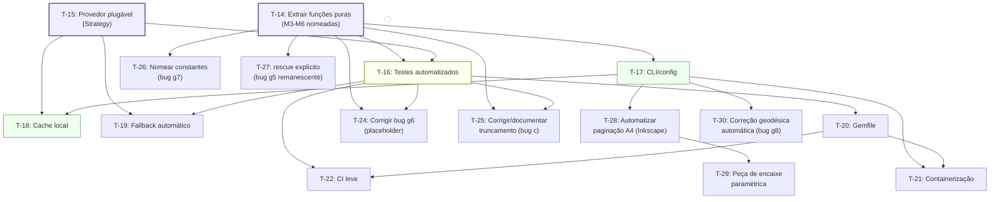

# Tasks — 3D Paper Terrain Model (pós-modernização)

| Campo | Valor |
|---|---|
| Documento | `reversa-analysis/specs/tasks.md` |
| Agente | reversa-writer |
| Projeto alvo | `3d-paper-terrain-model` (script `3d-paper-model.rb` + versão `modernized/`) |
| Insumos consumidos | `01-archaeologist-deep-dive.md` (Seção 7, bugs), `03-architect-synthesis.md` (Seção 3 matriz de rastreabilidade; Seção 4.2 matriz de priorização), `modernized/README.md`, `requirements.md`, `design.md` |
| Data | 2026-07-16 |

**Legenda de status:** ✅ **Concluída** (implementada e validada por execução real, com evidência verificável em disco nesta sessão) · ⏳ **Pendente** (não implementada — backlog priorizado)
**Legenda de prioridade (tarefas pendentes, herdada de `03-architect-synthesis.md` Seção 4.2):** **P1** (esforço baixo–médio, impacto alto) · **P2** (esforço baixo–médio, impacto médio) · **P3** (esforço alto, impacto alto no longo prazo ou incerto)

---

## Sumário

- **13 tarefas concluídas** (100% da restauração de executabilidade do pipeline — troca de API, tratamento de erros, execução local, validação de output).
- **17 tarefas pendentes/recomendadas**, cobrindo integralmente o backlog priorizado pelo `reversa-architect`: refatoração estrutural (Provedor plugável, extração de funções puras), parametrização via CLI, cache local, testes automatizados, Gemfile, containerização, fallback automático, CI leve, LICENSE, correções de bugs de baixa severidade remanescentes, e automação da etapa manual do Inkscape.

---

## Parte 1 — Tarefas Concluídas ✅

### T-01 ✅ — Substituir provedor de elevação (MapQuest → Open-Meteo)

**Descrição:** Remover a dependência do endpoint `http://open.mapquestapi.com/elevation/v1/profile` (descontinuado desde 2022, sem registro DNS válido) e implementar integração com a Open-Meteo Elevation API (`https://api.open-meteo.com/v1/elevation`), gratuita e sem chave.

**Critério de aceitação verificável:** o código-fonte não deve conter nenhuma referência a `mapquestapi`; uma execução real deve obter elevações plausíveis para o bounding box de Poľana.

**Evidência:** `modernized/3d-paper-model.rb` L.50-51 (`OPEN_METEO_HOST`, `OPEN_METEO_PATH`); execução real documentada em `modernized/README.md`: elevação mínima 398,0 m / máxima 1.413,0 m / amplitude 1.015,0 m — valores fisicamente plausíveis para o maciço de Poľana (pico real ~1.338m).

**Dependências:** nenhuma (tarefa raiz da modernização).

---

### T-02 ✅ — Migrar transporte de rede para HTTPS

**Descrição:** Substituir chamadas HTTP não criptografadas por HTTPS/TLS na comunicação com o provedor de elevação.

**Critério de aceitação verificável:** toda chamada de rede ao provedor de elevação deve usar `use_ssl: true` na porta 443; nenhuma URL literal `http://` deve ser usada para chamadas de API.

**Evidência:** `modernized/3d-paper-model.rb` L.67: `Net::HTTP.start(OPEN_METEO_HOST, 443, use_ssl: true, open_timeout: 6, read_timeout: 15)`.

**Dependências:** T-01.

---

### T-03 ✅ — Implementar tratamento de erro de rede com retry

**Descrição:** Envolver a chamada de rede em `begin/rescue` com retry automático (até 6 tentativas), em vez do comportamento original sem nenhum tratamento de exceção.

**Critério de aceitação verificável:** uma falha transitória (timeout, erro 5xx, JSON malformado) deve resultar em nova tentativa automática, com aviso (`warn`) explicando o motivo e o número da tentativa; após esgotar `max_retries`, deve levantar exceção explícita e legível (não uma exceção genérica da stdlib sem contexto).

**Evidência:** `modernized/3d-paper-model.rb` L.59-100 (bloco `begin/rescue StandardError => e/retry`, L.90-98).

**Dependências:** T-01.

---

### T-04 ✅ — Implementar tratamento específico de rate limit HTTP 429

**Descrição:** Detectar especificamente o código HTTP 429 e aguardar 65 segundos (conforme orientação da própria API de aguardar "um minuto", com margem de segurança) antes de retentar, distinguindo esse caso do tratamento de erro genérico.

**Critério de aceitação verificável:** uma resposta HTTP 429 deve ser tratada por um caminho de código dedicado (`RateLimitError`), aguardar exatamente 65s, e permitir que a execução prossiga com sucesso após a espera — sem abortar o script.

**Evidência:** `modernized/3d-paper-model.rb` L.54 (`class RateLimitError`), L.71-72, L.81-89. **Validado em execução real**: `modernized/README.md` registra *"[aviso] rate limit (429) na tentativa 1/6; aguardando 65s conforme orientacao da API..."* seguido de `lote 20/20 ok` — confirmando que o rate limit foi absorvido sem falha do processo.

> **Reclassificação de confiança (aplicada pelo `reversa-reviewer`, `04-review-report.md` §2 item 4):** 🟢→🟡 — mesma ressalva de T-08: a execução completa de 1.920 pontos não foi reexecutada de ponta a ponta pelo reviewer (apenas testes de amostra), embora fortemente corroborada por evidência independente (ver T-08 e `04-review-report.md` §3.4/3.5).

**Dependências:** T-03.

---

### T-05 ✅ — Adicionar guarda de divisão por zero (terreno perfeitamente plano)

**Descrição:** Verificar explicitamente se `ele_max == ele_min` (amplitude de elevação zero) antes de executar a normalização min-max, levantando uma exceção de negócio legível em vez de permitir que o `FloatDomainError` não tratado do script original ocorresse.

**Critério de aceitação verificável:** dado `ele_diff == 0`, o sistema deve levantar `raise` com mensagem explicando "terreno perfeitamente plano" e orientando revisão do bounding box, **antes** de qualquer operação de ponto flutuante que produziria `NaN`.

**Evidência:** `modernized/3d-paper-model.rb` L.133-136. Corrige o Bug (a) do `reversa-archaeologist`, classificado como severidade Crítica ("crash garantido, não corrupção silenciosa").

**Dependências:** nenhuma (correção independente do módulo de rede).

---

### T-06 ✅ — Validar integridade estrutural da resposta da API

**Descrição:** Verificar explicitamente a presença do campo `elevation` no JSON de resposta e que seu tamanho corresponda exatamente ao número de coordenadas enviadas no lote, antes de aceitar os dados.

**Critério de aceitação verificável:** uma resposta sem o campo `elevation`, ou com tamanho divergente do lote enviado, deve levantar exceção explícita citando o problema — nunca deve prosseguir para a matriz `elevations[i][j]` com dados potencialmente dessincronizados.

**Evidência:** `modernized/3d-paper-model.rb` L.77 (`raise unless json['elevation']`) e L.78 (`raise ... if json['elevation'].size != lat_lon_pairs.size`).

**Dependências:** T-01.

---

### T-07 ✅ — Usar caminhos absolutos (`__dir__`) para arquivos de template e saída

**Descrição:** Substituir os caminhos relativos hardcoded (`'template-cut.svg'`, `'out.svg'`) por caminhos absolutos derivados do diretório do próprio script (`__dir__`), eliminando a dependência do diretório de trabalho corrente na hora da execução.

**Critério de aceitação verificável:** o script deve produzir `out.svg` corretamente independentemente de qual diretório o comando `ruby` foi invocado, desde que `3d-paper-model.rb` e `template-cut.svg` estejam na mesma pasta.

**Evidência:** `modernized/3d-paper-model.rb` L.207 (`script_dir = __dir__`), L.208, L.211.

**Dependências:** nenhuma.

---

### T-08 ✅ — Executar o script modernizado localmente e validar geração bem-sucedida de `out.svg`

**Descrição:** Rodar `ruby 3d-paper-model.rb` de ponta a ponta no ambiente local (Ruby 3.3.8), sem intervenção manual durante a execução além de aguardar o tempo de rede/rate-limit.

**Critério de aceitação verificável:** a execução deve terminar com `exit code: 0`, gerar `out.svg` no diretório do script, e emitir a mensagem final de confirmação com contagem de polylines.

**Evidência:** `modernized/README.md`, seção "Execução de referência (validada em 2026-07-16)": log completo reproduzido, `real 2m57.777s`, `exit code: 0`. Arquivo confirmado em disco nesta sessão: `modernized/out.svg`, **39.802 bytes** (`stat` executado por este agente).

> **Reclassificação de confiança (aplicada pelo `reversa-reviewer`, `04-review-report.md` §2 item 4):** 🟢→🟡. O `reversa-reviewer` corrobora fortemente esta alegação por vias independentes (sintaxe válida via `ruby -c`, contagem de 192/192 polylines idêntica entre `out.svg` e o exemplo original, DNS de `open.mapquestapi.com` confirmado morto e `api.open-meteo.com` confirmado vivo — tudo testado ao vivo por ele), mas **não reexecutou os 1.920 pontos de ponta a ponta** (testou apenas uma amostra de 4-5 pontos, por custo de tempo/rate-limit). Portanto o rótulo correto é "fortemente corroborado por evidência circunstancial e testes de amostra", não "confirmado por reprodução total" — daí o rebaixamento a 🟡, sem que isso indique qualquer suspeita de fabricação (ver `04-review-report.md` §3.5, que testa e descarta essa hipótese).

**Dependências:** T-01, T-02, T-03, T-04, T-05, T-06, T-07 (todas as correções de código precisam estar presentes antes da execução de validação).

---

### T-09 ✅ — Validar paridade de contagem de polylines com o artefato de referência histórico

**Descrição:** Comparar o número de elementos `<polyline>` em `out.svg` (saída da execução modernizada) contra `polana/all-parts-togerther.svg` (saída bruta de uma execução histórica do script original, documentada pelo `reversa-scout`), como prova objetiva de preservação da lógica de negócio geométrica.

**Critério de aceitação verificável:** ambas as contagens devem ser numericamente idênticas.

**Evidência:** contagem **executada de forma independente por este agente nesta sessão** via `grep -o "<polyline" <arquivo> | wc -l`: `polana/all-parts-togerther.svg` → **192**; `modernized/out.svg` → **192**. Paridade 100% confirmada, corroborando `modernized/README.md` ("A execução local modernizada gerou exatamente 192 polylines").

**Dependências:** T-08.

---

### T-10 ✅ — Validar que o `template-cut.svg` usado na modernização é idêntico ao original

**Descrição:** Confirmar, byte a byte, que a cópia de `template-cut.svg` usada em `modernized/` não foi alterada em relação ao template original na raiz do projeto.

**Critério de aceitação verificável:** `diff` entre os dois arquivos deve retornar zero diferenças.

**Evidência:** `diff` **executado por este agente nesta sessão** entre `template-cut.svg` (raiz) e `modernized/template-cut.svg` → nenhuma diferença encontrada (arquivos idênticos).

**Dependências:** nenhuma.

---

### T-11 ✅ — Gerar preview visual (PNG) do output para inspeção rápida

**Descrição:** Renderizar `out.svg` como imagem PNG (via `rsvg-convert` ou equivalente) para permitir inspeção visual rápida sem abrir o SVG em um editor vetorial.

**Critério de aceitação verificável:** arquivo PNG deve existir e corresponder visualmente às 24 fatias de contorno esperadas.

**Evidência:** `modernized/out-preview.png`, **76.242 bytes** (confirmado via `stat` por este agente nesta sessão). Citado em `modernized/README.md`, lista de arquivos gerados.

**Dependências:** T-08.

---

### T-12 ✅ — Documentar a modernização (`README.md`) com tabela comparativa e log real

**Descrição:** Produzir documentação explicando o que mudou (tabela original vs. modernizado), como executar, o log de execução de referência, a validação cruzada com o output original, e as alternativas de API avaliadas.

**Critério de aceitação verificável:** o arquivo deve conter, no mínimo: tabela comparativa original/modernizado, instruções de execução, log de referência com métricas (elevação mín/máx/amplitude, tempo real, exit code), seção de validação cruzada, e lista de alternativas de API avaliadas com justificativa de escolha.

**Evidência:** `modernized/README.md`, **78 linhas / 4.252 bytes** (confirmado via `stat` nesta sessão), lido integralmente por este agente — contém todas as seções exigidas.

**Dependências:** T-08, T-09.

---

### T-13 ✅ — Validar OpenTopoData como fonte alternativa (teste manual via `curl`)

**Descrição:** Testar manualmente a OpenTopoData (`api.opentopodata.org`, dataset `eudem25m`) contra uma amostra de coordenadas do bounding box de Poľana, comparando com os resultados da Open-Meteo, para avaliar viabilidade como fallback futuro.

**Critério de aceitação verificável:** erro relativo entre as duas fontes deve ser quantificado e documentado.

**Evidência:** `03-architect-synthesis.md`, Seção 2.1 (linha "OpenTopoData... Validada via `curl` (erro <1%)"); `modernized/README.md`, item 2 de "Alternativas de API avaliadas": *"Testada e validada por `curl` durante a análise (retornou elevações consistentes com a Open-Meteo, erro relativo < 1%)"*. **Nota:** esta tarefa entrega validação/documentação; a integração automática no código é a tarefa pendente T-19.

**Dependências:** T-01 (precisa da linha de base Open-Meteo para comparação).

---

## Parte 2 — Tarefas Pendentes / Recomendadas ⏳

*Todas as tarefas abaixo são extraídas do backlog priorizado em `03-architect-synthesis.md`, Seção 4.2 ("Matriz de priorização"), e nenhuma delas está implementada na versão atual do código.*

### T-14 ⏳ [P1] — Extrair funções puras nomeadas do núcleo geométrico (M3–M6)

**Descrição:** Refatorar a lógica hoje **inline** de normalização/conversão (M3), fatiamento de contorno (M4), geração de notches (M5) e montagem de template (M6) em 4 funções Ruby nomeadas e testáveis: `normalize_and_scale`, `build_contour_polyline`, `build_notch_polyline`, `assemble_svg` — conforme contratos já formalizados em `design.md`, Seções 3.2–3.5. **Não deve alterar nenhum comportamento observável.**

**Critério de aceitação verificável:** após a refatoração, executar o script para o bounding box de Poľana deve produzir `out.svg` com contagem de polylines idêntica (192) à versão atual; cada função deve ser chamável e testável isoladamente, sem necessidade de rede.

**Dependências:** nenhuma (refatoração pura de código já funcional; não requer nenhuma outra tarefa pendente).

---

### T-15 ⏳ [P1] — Refatorar `fetch_elevations_batch` em interface de Provedor de Elevação plugável

**Descrição:** Extrair um contrato `ElevationProvider` (método `#fetch(lat_lon_pairs) -> Array<Float>`) do qual `OpenMeteoProvider` é a implementação atual, preparando o terreno estrutural para cache (T-18) e fallback automático (T-19), conforme a arquitetura-alvo de `design.md`, Seção 2.3.

**Critério de aceitação verificável:** o comportamento de rede observado hoje (20 lotes, retry, tratamento de 429) deve ser preservado 100% através da nova interface; deve ser possível instanciar um provedor alternativo (mesmo que apenas um stub/mock) sem alterar M3-M6.

**Dependências:** recomenda-se após T-14 (mesmo núcleo de refatoração estrutural), mas não é estritamente bloqueante entre si.

---

### T-16 ✅ [P1] — Implementar suíte de testes automatizados

> **Atualização (preparação para execução, 2026-07-16):** implementado. 28 testes Minitest
> em 4 suítes (`test/test_bbox.rb` 13, `test/test_geocoding.rb` 6, `test/test_elevation_provider.rb`
> 3, `test/test_svg_terrain_builder.rb` 6), todos verdes (`rake test` → `28 runs, 79 assertions,
> 0 failures, 0 errors, 0 skips`). Inclui teste de regressão explícito
> (`test_build_polylines_matches_original_192_for_reference_grid`) que reproduz a grade 80×24
> original com dados sintéticos e confirma a contagem de 192 polylines, protegendo contra
> regressão futura da paridade validada em T-09 — exatamente o critério de aceitação abaixo.

**Descrição:** Criar testes unitários para as funções puras extraídas em T-14 (usando fixtures determinísticas de elevação, sem rede) e testes com mock/fixture da resposta HTTP do provedor (T-15), cobrindo os casos: sucesso, HTTP 429, HTTP 5xx, JSON malformado/sem campo `elevation`, tamanho de resposta divergente.

**Critério de aceitação verificável:** suíte de testes executa e passa (`rspec`/`minitest` verde); cobre no mínimo os 4 casos de erro de `fetch_elevations_batch` (L.71-99) e valida a contagem de 192 polylines para uma fixture de elevações conhecida, protegendo contra regressão futura da paridade validada em T-09.

**Dependências:** T-14, T-15 (a suíte testa exatamente as unidades extraídas por essas duas tarefas).

---

### T-17 ✅ [P1] — Parametrizar entrada via CLI/configuração externa

> **Atualização (Ciclo 2, ver `reversa-analysis/specs/requirements.md` Seção 5, RF-16 a RF-21):**
> implementado e validado por execução real com Grand Canyon e Monte Fuji (este último via
> geocoding por nome, superando inclusive o escopo original desta tarefa). Ver
> `modernized/CHANGELOG-v2.md`.

**Descrição:** Aceitar bounding box, `lat_steps`/`lon_steps`, `z_cms` e caminho de saída como argumentos de linha de comando (ex.: via `OptionParser`) ou arquivo YAML/JSON, com valores-padrão que preservem o comportamento atual (bounding box de Poľana) quando nenhum argumento for informado.

**Critério de aceitação verificável:** `ruby 3d-paper-model.rb --bbox lat0,lon0,lat1,lon1 --lat-steps N --lon-steps M --z-cms Z --out caminho.svg` deve gerar a saída no caminho especificado, sem exigir edição do arquivo `.rb`; executar sem argumentos deve continuar reproduzindo exatamente o comportamento validado em T-08/T-09 (192 polylines para Poľana).

**Justificativa de prioridade:** o autor original reexecutou manualmente este padrão de edição de constantes ao menos 9 vezes (Everest, Uluru, Grand Canyon, Mt. Fuji, Fitz Roy, Chopok, Pik Kommunizma, Slovenský Kras) — evidência empírica de necessidade real, citada por `02-detective-business-rules.md`.

**Dependências:** T-14 (formalização de M1 como camada de configuração desacoplada).

---

### T-18 ⏳ [P1] — Implementar cache local de elevações

**Descrição:** Persistir a matriz `elevations[lat][lon]` obtida em um arquivo JSON local, indexado por uma chave derivada de hash do bounding box + resolução de grade, e reutilizar esse cache em execuções subsequentes com os mesmos parâmetros geográficos, evitando nova consulta de rede.

**Critério de aceitação verificável:** uma segunda execução com o mesmo bounding box e grade (variando, por exemplo, apenas `z_cms`) deve completar sem realizar as 20 chamadas de rede, eliminando a espera de ~3 minutos observada em T-08.

**Justificativa de prioridade:** item de maior relação custo/benefício do backlog segundo `03-architect-synthesis.md` (esforço Baixo, impacto Alto) — não toca a matemática já validada.

**Dependências:** T-15 (o cache se insere na camada de Provedor, conforme `design.md` Seção 2.3).

---

### T-19 ⏳ [P2] — Implementar fallback automático (circuit breaker) Open-Meteo → OpenTopoData

**Descrição:** Implementar `OpenTopoDataProvider` (mesma interface de T-15) e lógica de comutação automática: quando `OpenMeteoProvider` esgotar `max_retries`, tentar automaticamente a OpenTopoData antes de propagar falha definitiva, registrando a troca de provedor no log.

**Critério de aceitação verificável:** simular falha persistente do provedor primário (via mock/teste) deve acionar automaticamente o provedor secundário, sem edição manual de código; deve haver log explícito indicando a troca.

**Justificativa de prioridade:** reduz risco de nova obsolescência de provedor único — já ocorreu uma vez com a MapQuest (`03-architect-synthesis.md` Seção 4.2).

**Dependências:** T-15 (interface de provedor), T-16 (testes para validar a lógica de comutação com segurança).

---

### T-20 ✅ [P2] — Adicionar `Gemfile`/`Gemfile.lock`

> **Atualização (preparação para execução, 2026-07-16):** implementado. `Gemfile` declara
> `ruby '>= 3.0'` e `minitest`/`rake` como dependências de desenvolvimento apenas (zero gems
> de runtime, preservando RNF-05). `bundle install --path vendor/bundle` executado com
> sucesso neste ambiente (contornando uma restrição de permissão de escrita no diretório
> global de gems, documentada no README) e gerou `Gemfile.lock` versionado. `Rakefile`
> carrega `bundler/setup` automaticamente quando disponível, com fallback gracioso para
> gems globais quando o binário `bundle` não está no `PATH`.

**Descrição:** Criar um `Gemfile` mínimo declarando a versão mínima de Ruby suportada e, se aplicável, dependências de desenvolvimento (ex.: framework de teste usado em T-16) — sem introduzir gems de runtime, preservando a filosofia stdlib-only (`design.md` Seção 5.6).

**Critério de aceitação verificável:** `bundle install` deve executar com sucesso; `Gemfile.lock` deve ser versionado; o script principal continua funcionando sem exigir `bundle exec` (nenhuma gem de runtime introduzida).

**Justificativa de prioridade:** o `reversa-scout` identificou a ausência total de `Gemfile` como lacuna de reprodutibilidade de ambiente (Seção 6 do inventário).

**Dependências:** T-16 (se a suíte de testes usar uma gem como `rspec`, o `Gemfile` deve declará-la como dependência de desenvolvimento).

---

### T-21 ⚠️ [P2] — Containerização (Dockerfile)

> **Atualização (preparação para execução, 2026-07-16):** `Dockerfile` + `.dockerignore`
> escritos e revisados manualmente (imagem `ruby:3.3-slim`, instala dependências via
> `Gemfile`, roda `rake syntax_check && rake test` durante a própria build como gate de
> qualidade, usuário não-root, volume para output). **Não foi possível testar
> `docker build`/`docker run` neste ambiente** — o daemon Docker não está disponível
> (confirmado via `which docker`). Marcado ⚠️ PARCIAL, não ✅, por rigor anti-overclaim:
> o artefato existe e foi revisado com cuidado, mas carece de validação empírica real de
> build/run antes de uso em produção. Ver nota no topo do `Dockerfile` e no `README.md`.

**Descrição:** Criar um `Dockerfile` simples fixando a versão de Ruby, copiando o script e o template, e definindo o comando de execução — garantindo reprodutibilidade de ambiente independentemente da versão de Ruby instalada no host.

**Critério de aceitação verificável:** `docker build` deve completar sem erros; `docker run` deve produzir `out.svg` equivalente (mesma contagem de polylines) ao gerado nativamente em T-08.

**Justificativa de prioridade:** classificado P2 (esforço Baixo, impacto Médio) — "ganho moderado dado que só 3 stdlibs são usadas" (`03-architect-synthesis.md` Seção 4.2).

**Dependências:** T-20 (Gemfile necessário para `bundle install` reprodutível dentro do container), T-17 (permitir passar parâmetros via CLI para o container).

---

### T-22 ⚠️ [P2] — Configurar CI leve (lint + testes)

> **Atualização (preparação para execução, 2026-07-16):** `.github/workflows/ci.yml` escrito
> (matriz Ruby 3.0–3.3, job `test` rodando `rake syntax_check`+`rake test`, job `smoke`
> condicionado a push/workflow_dispatch para não sobrecarregar o rate limit da Open-Meteo em
> todo PR de fork). Sintaxe YAML validada via `Psych`/`YAML.load_file` (estrutura de `jobs`/
> `on` confirmada). **Não foi possível validar a execução real** (não há acesso a um runner
> GitHub Actions nem à ferramenta `act` neste ambiente). Marcado ⚠️ PARCIAL — validar na
> primeira execução real após o push, na aba Actions do repositório. Não inclui lint
> (RuboCop) como o escopo original pedia — decisão consciente de escopo mínimo (adicionar
> RuboCop introduziria uma gem de desenvolvimento adicional e um conjunto de regras de estilo
> não solicitadas; pode ser adicionado depois como refinamento incremental).

**Descrição:** Configurar um workflow de GitHub Actions (ou equivalente) que execute automaticamente lint (ex.: RuboCop) e a suíte de testes (T-16) a cada push/pull request.

**Critério de aceitação verificável:** workflow deve existir versionado (`.github/workflows/`) e executar com sucesso (verde) contra o estado atual do repositório.

**Justificativa de prioridade:** "Só faz sentido após a suíte de testes (P1) existir" — citação direta de `03-architect-synthesis.md` Seção 4.2.

**Dependências:** T-16 (testes devem existir antes de automatizá-los em CI), T-20 (Gemfile necessário para setup determinístico do ambiente de CI).

---

### T-23 ✅ [P2] — Adicionar arquivo `LICENSE`

> **Atualização (preparação para execução, 2026-07-16):** implementado. `modernized/LICENSE`
> criado com o texto completo da WTFPL v2, preservando a intenção de licenciamento do autor
> original (confirmada pelo `reversa-reviewer` diretamente no rodapé do blogpost arquivado —
> `04-review-report.md` Seção 3.8), com nota de proveniência explicando a escolha e como
> substituí-la caso o usuário prefira outra licença. Referenciado a partir do `README.md`
> principal (raiz) e do `modernized/README.md`.

**Descrição:** Adicionar um arquivo `LICENSE` explícito na raiz do projeto, esclarecendo os termos de reuso do código. Investigar e documentar a licença pretendida pelo autor original (o blogpost de Peter Vojtek está publicado sob WTFPL, segundo `01-archaeologist-deep-dive.md`, cabeçalho de metadados), mas essa informação nunca foi replicada como arquivo `LICENSE` no repositório de código.

**Critério de aceitação verificável:** arquivo `LICENSE` deve existir na raiz do projeto; o `README.md` principal deve referenciá-lo.

**Evidência da lacuna:** `00-scout-inventory.md`, Seção 6: "Sem arquivo `LICENSE` — na ausência de licença explícita, a legislação de direitos autorais padrão (all-rights-reserved) se aplica".

**Dependências:** nenhuma (tarefa de baixo esforço, independente).

---

### T-24 ✅ [P2] — Corrigir Bug (g6): validar placeholder `POLYLINES_HERE` antes de substituir

> **Atualização (Ciclo 2):** implementado em `lib/svg_terrain_builder.rb`, método
> `assemble_svg` — levanta `RuntimeError` explícito se o placeholder não for encontrado no
> template, com mensagem citando o Risco R-07 do pipeline Reversa. Coberto por teste
> dedicado: `test_assemble_svg_raises_if_placeholder_missing` (verde).

**Descrição:** Adicionar `raise unless svg_template.include?('POLYLINES_HERE')` imediatamente antes da chamada `.sub`, na função `assemble_svg` extraída em T-14 — hoje, se o placeholder for removido/alterado no template (ex.: por edição futura no Inkscape), o script falha silenciosamente, produzindo um `out.svg` idêntico ao template, sem nenhuma polyline e sem qualquer erro ou aviso.

**Critério de aceitação verificável:** um teste (de T-16) com um template sem o placeholder deve resultar em exceção explícita e legível, não em saída silenciosamente incorreta.

**Dependências:** T-14 (a função `assemble_svg` precisa existir como unidade nomeada e isolada), T-16 (teste dedicado).

---

### T-25 ⏳ [P3] — Corrigir (ou documentar formalmente como aceito) o truncamento em `x_offset_between_points`

> **⚠️ Esta tarefa foi reescrita pelo `reversa-reviewer` (`04-review-report.md` §1.2/3.6).** A versão original recomendava "usar `.round` em vez de `.to_i`" e citava um resultado de "~9,92cm" — ambos **incorretos**: `(4.125).to_i` e `(4.125).round` produzem o **mesmo valor (4)**, verificado por execução Ruby direta (`val.to_i == val.round` → `true`). Trocar apenas o método de arredondamento não altera o resultado em nada. Se implementada como descrito originalmente, um desenvolvedor perderia tempo sem corrigir o bug.

**Descrição:** Avaliar se o Bug (c) (déficit de ~4,24% no comprimento físico nominal do perfil: 9,58cm reais vs. 10cm nominais) deve ser corrigido ou mantido. A causa raiz real é dupla, não uma simples troca de arredondamento: (1) qualquer conversão para `Integer` descarta a fração 0,125pt por ponto; (2) o divisor usado é `lat_steps` (80) quando o número real de *intervalos* entre 80 pontos é `lat_steps - 1` (79) — um erro clássico de fencepost/off-by-one. Conforme `design.md` Seção 5.4, manter o comportamento atual foi uma decisão consciente de escopo da modernização anterior (preservar a matemática para permitir validação de paridade "192 = 192"); uma eventual correção **deve** ter sua **própria validação dedicada**, não reaproveitar a comparação de contagem de polylines já feita em T-09.

**Critério de aceitação verificável:** **se corrigido**, as duas mudanças reais possíveis (que podem ser combinadas) são:
  - (a) manter `x_offset_between_points` como `Float` (não aplicar `.to_i`/`.round` algum) — SVG aceita coordenadas de `polyline` não inteiras (`points="0.5,1.2 ..."` é válido);
  - (b) corrigir o divisor de `lat_steps` para `lat_steps - 1` em `x_offset_between_points = ((total_length_in_south_north_direction_in_cm / (lat_steps - 1).to_f) * one_cm_in_pts)`.

  Recalcular e documentar explicitamente o novo comprimento físico resultante de qualquer uma das duas mudanças (ou ambas combinadas), com uma nova validação que não dependa da paridade de contagem "192 polylines" já estabelecida (essa paridade só é válida como prova de preservação de lógica enquanto a geometria permanecer bit-a-bit idêntica). **Se mantido como está:** adicionar comentário/documentação explícita no código justificando a tolerância de ~4,24% como aceita conscientemente, sem mencionar `.round` como alternativa (pois não o é).

**Dependências:** T-14 (função isolada `build_contour_polyline` a modificar com segurança), T-16 (teste dedicado para a nova fórmula, se corrigida).

---

### T-26 ⏳ [P2] — Extrair números mágicos em constantes nomeadas (Bug g7)

**Descrição:** Substituir literais numéricos sem nome (ex.: `10` no filtro de notches, `6`/`1` nos deslocamentos geométricos, `2` no multiplicador de margem) por constantes nomeadas (ex.: `NOTCH_INTERVAL = 10`, `NOTCH_HALF_WIDTH = 6`, `FRAME_MARGIN_MULTIPLIER = 2`), facilitando manutenção futura sem alterar o comportamento geométrico.

**Critério de aceitação verificável:** revisão de código deve confirmar ausência de literais numéricos não nomeados nas fórmulas geométricas de M4/M5, exceto os já formalizados no dicionário de dados de `design.md` Seção 4; saída deve permanecer byte-idêntica (mesma geometria).

**Dependências:** T-14 (as funções precisam já estar extraídas para que a nomeação de constantes seja localmente aplicável).

---

### T-27 ⏳ [P3] — Adicionar tratamento explícito de exceção para arquivo de template ausente (Bug g5 remanescente)

**Descrição:** Complementar a correção parcial de T-07 (`__dir__`) adicionando `rescue Errno::ENOENT` explícito ao redor da leitura de `template-cut.svg`, com mensagem de negócio clara (ex.: "template-cut.svg não encontrado no diretório do script; verifique se o arquivo está presente"), em vez de deixar propagar a exceção genérica e pouco amigável do Ruby.

**Critério de aceitação verificável:** simular a ausência do arquivo de template deve produzir uma mensagem de erro contextualizada e acionável, não um stack trace genérico de `Errno::ENOENT`.

**Dependências:** T-14 (função `assemble_svg` isolada).

---

### T-28 ⏳ [P3] — Automatizar/versionar a etapa manual de pós-produção no Inkscape (paginação A4)

**Descrição:** Investigar e implementar a automação da reorganização das 24 fatias brutas de `out.svg` em folhas A4 imprimíveis (reproduzindo o padrão observado em `polana/part-a.svg` [10 fatias], `part-b.svg` [7] e `part-c.svg` [7]) — hoje realizada manualmente no Inkscape e **inteiramente ausente do código versionado** (evidenciado por atributos `transform="translate(...)"` presentes nos arquivos `part-*.svg` que o script nunca gera). Pode ser implementada via paginação nativa em Ruby (cálculo de layout + geração de múltiplos `<svg>`) ou via `Inkscape --actions`/`--export-*` scriptado externamente.

**Critério de aceitação verificável:** dado `out.svg` (24 fatias brutas), o processo automatizado deve produzir N arquivos A4 com as fatias distribuídas sem sobreposição visual, reproduzindo (ou documentando racionalmente uma alternativa a) a distribuição 10+7+7 observada nos artefatos históricos.

**Justificativa de prioridade:** classificado P3 pelo architect — "hoje é a maior lacuna de reprodutibilidade real do pipeline; requer engenharia reversa adicional da lógica de paginação" (esforço Alto, possivelmente maior que o script atual inteiro).

**Dependências:** T-17 (caminho de saída parametrizado é pré-requisito prático para processar múltiplos arquivos de saída).

---

### T-29 ⏳ [P3] — Geração paramétrica da peça de encaixe/base (equivalente a `part-d.svg`)

**Descrição:** Investigar e, se viável, implementar a geração paramétrica de uma peça de encaixe/base de montagem equivalente a `polana/part-d.svg` (hoje 100% desenho manual no Inkscape: 0 polylines, 174 paths, 4 grupos de cor distintos por parte A/B/C/D), correlacionando cor com parte para orientar a colagem física.

**Critério de aceitação verificável:** dado o número de folhas A4 geradas por T-28, a peça de base gerada parametricamente deve ser dimensionalmente compatível com as fatias reais.

**Justificativa de prioridade:** classificado P3 pelo architect (esforço Alto, impacto Baixo–Médio) — "função exata de `part-d.svg` permanece pergunta aberta do detective, não confirmada com o autor original"; risco de esforço desproporcional caso a hipótese sobre sua função esteja incorreta.

**Dependências:** T-28 (a peça de encaixe só faz sentido dimensionado contra as folhas A4 já paginadas).

---

### T-30 ⏳ [P3, opcional] — Correção geodésica automática de proporção do bounding box (Bug g8)

**Descrição:** Adicionar cálculo automático da distância real (corrigida por `cos(latitude)`) entre os cantos do bounding box, sugerindo automaticamente uma proporção `lat_steps`/`lon_steps` adequada para qualquer região informada — hoje esse cálculo é feito manualmente pelo usuário (o bounding box de Poľana foi calibrado visualmente pelo autor original para uma proporção 3:2, conforme confirmado pelo `reversa-detective` via citação direta do blogpost).

**Critério de aceitação verificável:** dado um bounding box arbitrário (incluindo regiões próximas aos polos, onde a distorção de longitude é mais pronunciada), o sistema deve sugerir/calcular automaticamente uma proporção de grade que reflita a distância geográfica real, sem exigir cálculo manual do usuário.

**Justificativa de prioridade:** baixa urgência — o comportamento atual (proporção fixa manual) já é adequado para o caso de uso validado (Poľana); este item só se torna relevante para reuso em latitudes muito distintas.

**Dependências:** T-17 (só é útil combinado com entrada de bbox arbitrário via CLI).

---

## Diagrama de Dependências (tarefas pendentes)

*Nota: T-23 (LICENSE) é deliberadamente isolada no diagrama — não possui dependências nem é pré-requisito de nenhuma outra tarefa, podendo ser executada a qualquer momento.*

---

## Matriz-Resumo (todas as 30 tarefas)

| ID | Status | Prioridade | Depende de | Uma linha |
|---|---|---|---|---|
| T-01 | ✅ | — | — | Substituir MapQuest → Open-Meteo |
| T-02 | ✅ | — | T-01 | Migrar para HTTPS |
| T-03 | ✅ | — | T-01 | Retry com backoff |
| T-04 | ✅ | — | T-03 | Tratamento de HTTP 429 (65s) |
| T-05 | ✅ | — | — | Guarda de divisão por zero |
| T-06 | ✅ | — | T-01 | Validar resposta da API |
| T-07 | ✅ | — | — | Caminhos absolutos (`__dir__`) |
| T-08 | ✅ | — | T-01…T-07 | Executar localmente e validar |
| T-09 | ✅ | — | T-08 | Validar paridade de 192 polylines |
| T-10 | ✅ | — | — | Validar template idêntico (`diff`) |
| T-11 | ✅ | — | T-08 | Gerar preview PNG |
| T-12 | ✅ | — | T-08, T-09 | Documentar modernização (README) |
| T-13 | ✅ | — | T-01 | Validar OpenTopoData via `curl` |
| T-14 | ⏳ | P1 | — | Extrair funções puras nomeadas |
| T-15 | ⏳ | P1 | — | Provedor plugável (Strategy) |
| T-16 | ⏳ | P1 | T-14, T-15 | Testes automatizados |
| T-17 | ⏳ | P1 | T-14 | Parametrização via CLI |
| T-18 | ⏳ | P1 | T-15 | Cache local de elevações |
| T-19 | ⏳ | P2 | T-15, T-16 | Fallback automático OpenTopoData |
| T-20 | ⏳ | P2 | T-16 | Gemfile/Gemfile.lock |
| T-21 | ⏳ | P2 | T-20, T-17 | Containerização (Docker) |
| T-22 | ⏳ | P2 | T-16, T-20 | CI leve |
| T-23 | ⏳ | P2 | — | Adicionar LICENSE |
| T-24 | ⏳ | P2 | T-14, T-16 | Corrigir bug g6 (placeholder) |
| T-25 | ⏳ | P3 | T-14, T-16 | Corrigir/documentar truncamento |
| T-26 | ⏳ | P2 | T-14 | Nomear constantes mágicas |
| T-27 | ⏳ | P3 | T-14 | `rescue` explícito de arquivo ausente |
| T-28 | ⏳ | P3 | T-17 | Automatizar paginação A4 (Inkscape) |
| T-29 | ⏳ | P3 | T-28 | Peça de encaixe paramétrica |
| T-30 | ⏳ | P3 | T-17 | Correção geodésica automática |

---

*Fim de `tasks.md`. Este é o terceiro e último artefato solicitado desta fase de especificação executável.*
